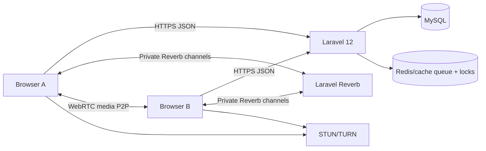

# SignalRoom

SignalRoom is a Laravel 12 one-page random one-to-one video chat app. Laravel owns anonymous sessions, matchmaking, private room authorization, safety workflows, cleanup, and WebRTC signaling. Browser media is handled only by WebRTC; the app never records, stores, proxies, or logs audio/video, screenshots, SDP, or ICE candidate bodies.



## Requirements

- PHP 8.3+ for production, Composer, Node 20+, MySQL 8, Redis, HTTPS.
- Laravel Reverb for WebSocket signaling.
- A production TURN service. Public STUN alone is useful for development but not reliable for real users.

The local machine currently reports PHP 8.2.12, so upgrade PHP before treating this as a PHP 8.3+ production runtime.

## Install

```bash
composer install
npm install
cp .env.example .env
php artisan key:generate
php artisan migrate
npm run build
```

Development processes:

```bash
php artisan serve
php artisan reverb:start
php artisan queue:work
php artisan schedule:work
npm run dev
```

For local camera/microphone testing, use HTTPS. Laravel Herd, Valet, mkcert, Caddy, or a trusted local reverse proxy all work. Browsers restrict camera and microphone access on insecure origins.

## Required Secrets

Set real values for `APP_KEY`, `REVERB_APP_ID`, `REVERB_APP_KEY`, `REVERB_APP_SECRET`, `VIDEOCHAT_FINGERPRINT_KEY`, database credentials, Redis credentials, and TURN credentials. Do not commit production secrets.

## TURN / coturn

Run coturn with TLS on `turns:your-domain:5349`, open UDP/TCP relay ports, and prefer time-limited credentials generated server-side or by coturn REST auth. Set:

```env
WEBRTC_TURN_URLS=turns:turn.example.com:5349?transport=tcp,turn:turn.example.com:3478?transport=udp
WEBRTC_TURN_USERNAME=short-lived-user
WEBRTC_TURN_CREDENTIAL=short-lived-password
```

Validate with Trickle ICE or an internal browser checklist using a TURN-only configuration. Avoid exposing long-lived shared secrets to frontend JavaScript.

## Production Checklist

- `APP_ENV=production`, `APP_DEBUG=false`, `APP_URL=https://your-domain`.
- `SESSION_SECURE_COOKIE=true`, trusted proxy headers configured at the load balancer.
- `BROADCAST_CONNECTION=reverb`, `CACHE_STORE=redis`, `VIDEOCHAT_QUEUE_STORE=redis`.
- Restrict `REVERB_ALLOWED_ORIGINS` and `CORS_ALLOWED_ORIGINS` to your real origin.
- Configure log scrubbing so request bodies for `/api/signals` are never logged.
- Run `php artisan videochat:cleanup` every minute via the scheduler.
- Add a human moderation/admin workflow around the `reports` table.

Nginx sketch:

```nginx
server {
    listen 443 ssl http2;
    server_name example.com;
    root /var/www/signalroom/public;

    location / {
        try_files $uri $uri/ /index.php?$query_string;
    }

    location /app/ {
        proxy_http_version 1.1;
        proxy_set_header Host $host;
        proxy_set_header X-Forwarded-Proto https;
        proxy_set_header Upgrade $http_upgrade;
        proxy_set_header Connection "Upgrade";
        proxy_pass http://127.0.0.1:8080;
    }

    location ~ \.php$ {
        include fastcgi_params;
        fastcgi_pass unix:/run/php/php8.3-fpm.sock;
        fastcgi_param SCRIPT_FILENAME $realpath_root$fastcgi_script_name;
    }
}
```

systemd examples:

```ini
[Service]
WorkingDirectory=/var/www/signalroom
ExecStart=/usr/bin/php artisan reverb:start --host=0.0.0.0 --port=8080
Restart=always
```

```ini
[Service]
WorkingDirectory=/var/www/signalroom
ExecStart=/usr/bin/php artisan queue:work --tries=3 --timeout=60
Restart=always
```

## Testing

```bash
php artisan test
npm run build
```

Redis integration pass:

```bash
VIDEOCHAT_QUEUE_STORE=redis CACHE_STORE=redis php artisan test
```

Manual two-browser checklist:

- Two desktop browsers join with different display names and receive a match.
- Desktop-to-mobile and mobile portrait/landscape calls connect.
- Camera denial and microphone denial show retryable errors.
- One participant refreshes, closes the tab, loses network, and reconnects.
- TURN-only ICE configuration connects across different networks.
- Next Person closes the old room, applies cooldown, and rematches.
- Report and Block create metadata only; no screenshots or recordings are captured.
- Mobile camera switching replaces the outgoing track.

Troubleshooting:

- Camera permission: confirm HTTPS, same-origin permissions policy, and browser site settings.
- WebSocket connection: check `VITE_REVERB_*`, `REVERB_*`, Nginx upgrade headers, and allowed origins.
- ICE failure: add TURN, verify firewall relay ranges, and test TCP/TLS TURN.
- Mixed content: keep `APP_URL`, Reverb scheme, and TURN URLs aligned with HTTPS.
# Video-Calling-Web-App
